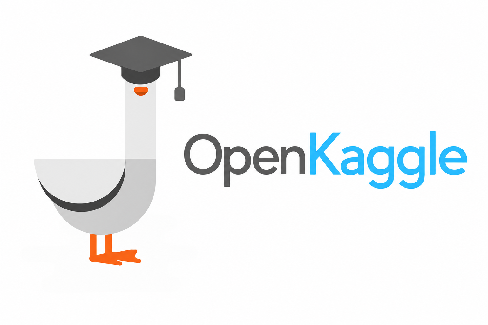

  

# OpenKaggle brand assets

OpenKaggle is an independent open workbench for reproducible Kaggle projects,
experiments, research plans, and open data. This repository keeps the visual
identity inspectable, reusable, and versioned alongside the research community
it represents.

OpenKaggle is an independent community project and is not affiliated with,
endorsed by, or sponsored by Kaggle or Google.

## Asset family

| Asset | Intended use |
| --- | --- |
| `assets/openkaggle-primary-transparent.png` | Preferred horizontal identity and README header |
| `assets/openkaggle-square-avatar.png` | Organization avatar and small circular crops |
| `assets/openkaggle-square-duck-type-left.png` | Square duck-and-type lockup with flush-left two-line wordmark |
| `assets/openkaggle-square-type-only-left.png` | Square type-only lockup with flush-left two-line wordmark |
| `assets/openkaggle-clean-white.png` | Light-background documents and presentations |
| `assets/openkaggle-soft-glow.png` | Secondary banners and editorial surfaces |
| `assets/openkaggle-join-button-v1.png` | Clickable homepage Join OpenKaggle call-to-action |
| `reference/source-duck-logo.png` | Original user-supplied reference, retained for provenance rather than as the preferred public mark |

The graduate duck is the stable symbol. The wordmark is always spelled
`OpenKaggle`, with no space, and uses charcoal plus cyan to separate the open
community layer from the competition context. In the two-line lockups, `Open`
and `Kaggle` share one weight and a strict left edge.

The wordmarks are raster studies; no third-party font binary is bundled or
required. See `SOURCE.md` for the generation and rights boundary.

## Usage

- Keep clear space around the mark; do not crowd it with badges or slogans.
- Use the square avatar where the platform will crop the image into a circle.
- Use `openkaggle-join-button-v1.png` only as a linked image; the artwork is
  decorative, so keep a nearby text link or descriptive alt text for keyboard,
  screen-reader, and image-blocked users.
- Do not alter the mark to imply official Kaggle or Google endorsement.
- Preserve provenance when publishing derivatives; see `SOURCE.md` and
  `ASSET_MANIFEST.sha256`.

Contributions and alternate formats are welcome. See `CONTRIBUTING.md` before
adding a new family member.
